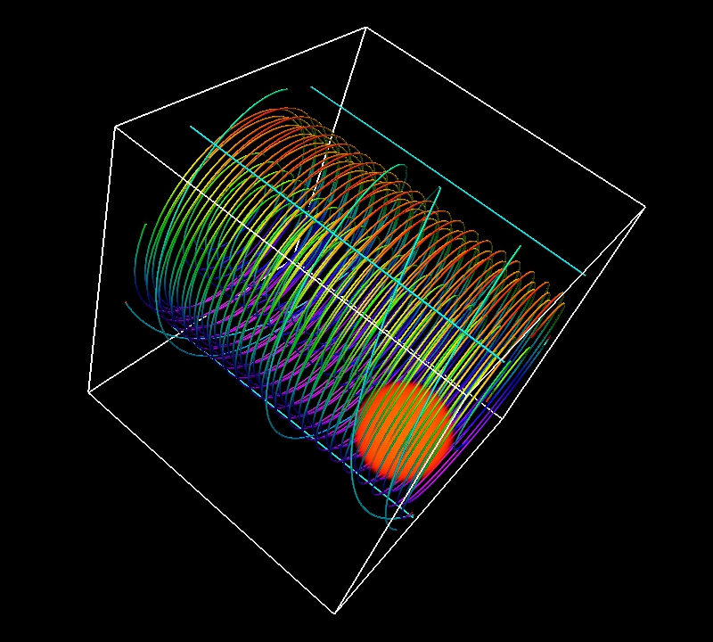
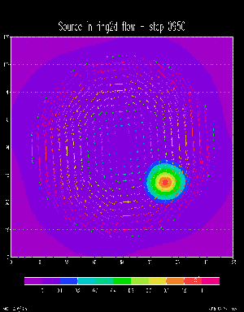

## MPDATA: positive definite transport equation solver

[](http://youtu.be/PT01Ygx-uTA)

[](http://youtu.be/PT01Ygx-uTA)

An independent implementation of MPDATA solver by Piotr K. Smolarkiewicz and Len G. Margolin ([paper](https://www.rsmas.miami.edu/users/miskandarani/Courses/MPO662/Smolarkiewicz/MPDATAreview.JCP140.pdf)) used in [EULAG model](http://www.mmm.ucar.edu/eulag/). Our method is designed with built-in grid decomposition for multithread/multiprocess parallelism. We develop CUDA kernels for calculating concentrations and pseudo-velocities on GPUs. The source code includes multiple simple physical test cases.

### Prerequisites

* CMake building tool:

```
$ sudo apt-get install cmake
```

* NETCDF headers & libraries:

```
$ sudo apt-get install libnetcdf-dev
```

* GRADS - 2D visualization tool often used in meteorology:

```
$ sudo apt-get install grads
```

* VAPOR - 3D visualization tool: download *v2.3.0* (other versions might be incompatible!) from the [website](https://www.vapor.ucar.edu/page/vapor-download#Binary) and install to `/opt/vapor`

### Building on Linux

```
$ git clone https://github.com/apc-llc/mpdata.git
$ mkdir build
$ cd build
$ cmake ..
$ make -j12
```

### Testing `ring2d` on Linux

The `ring2d` test shows aerosol transfer from the source point in the rounded flow. Ideally, aerosol blob should rotate in the flow without form change and mass dissipation. In practice, finite difference approximation always has accuracy limitations resulting into deformation and energy dissipation. Such diagnostic test is often used for finite difference method verification.

```
$ ./ring2d 128 1024
$ perl rind2d.pl
```

Individual visualization frames will be save to `rind2d_frames` subfolder. They could we futher rendered into a movie:

```
$ sudo apt-add-repository ppa:mc3man/trusty-media
$ sudo apt-get update
$ sudo apt-get install ffmpeg
$ ffmpeg -i ring2d_frames/step%04d.png -c:v libx264 -pix_fmt yuv420p ring2d.mp4
```

See the resulting [video](http://youtu.be/PT01Ygx-uTA).

### Testing `ring3d` on Linux

```
$ source /opt/vapor/bin/vapor-setup.sh
$ ./ring3d 128 128
```

Use VAPOR to make 3D visualization (Data -> Load a Dataset into Current Session -> ring3d.vdf):

```
$ vaporgui
```

Frames captured from VAPOR could be also rendered into a [movie](http://youtu.be/PT01Ygx-uTA)

